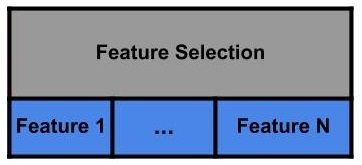

# **N**eural **N**etwork optimized by **G**enetic **A**lgorithms - (NNGA)

**This code was developed during the master's project 'Genetic Algorithms and Convolutional Neural Networks to Aid the Diagnosis of Vertebral Compression Fractures' of the Graduate Program in Applied Computing at the Faculty of Philosophy, Sciences and Letters of Ribeirão Preto, University of São Paulo.**
 
### Thesis: 
* [Algoritmos genéticos e redes neurais convolucionais para auxílio ao diagnóstico de fraturas vertebrais por compressão](https://www.teses.usp.br/teses/disponiveis/59/59143/tde-07122020-220625/pt-br.php)

### Article(s):
* Computer-Aided Diagnosis of Vertebral Compression Fractures Using Convolutional Neural Networks and Radiomics - Journal of Digital Imaging

**Current stable version**: 2.0.0

**Neural Network optimized by Genetic Algorithms - (NNGA)** is a library for deep model training, 
for data classification and segmentation. 
The adjustment of the model parameters can be done by genetic algorithm or 
can be defined by pre-trained models. 
For classification task, feature selection can be done by a genetic algorithm.

The NNGA works well for medical data, because with NNGA is possible training a model 
using both image exam result and laboratory exam /paciente information simultaneously. 
NNGA also preserves the image ratio, filling the background with black to maintain the 
actual proportion of the exam.
 

The model accepts two data entry sources:
1. Images
    
    The format of the images should be:
    * Windows bitmap (bmp)
    * Portable image formats (pbm, pgm, ppm)
    * Sun raster (sr, ras)
    * JPEG (jpeg, jpg, jpe)
    * JPEG 2000 (jp2)
    * TIFF files (tiff, tif)
    * Portable network graphics (png)
2. CSV file

    2.1. The sample class should be in the column with label "class"
    
    2.2 If the two data sources are used simultaneously, the CSV file should be a column with label "id" containing the corresponding image name (without extension)

## Installation
```bash
git clone https://github.com/rafaelsdellama/nnga.git
cd nnga
pip install .
```

## Models

The table below shows all the models that can be created: 

|      TASK      | ARCHITECTURE |                                                                                                                                              BACKBONE                                                                                                                                              | FEATURE_SELECTION |
|:--------------:|:------------:|:--------------------------------------------------------------------------------------------------------------------------------------------------------------------------------------------------------------------------------------------------------------------------------------------------:|:-----------------:|
| Classification |      MLP     |                                                                                                                                              GASearch                                                                                                                                              |        True       |
| Classification |      MLP     |                                                                                                                                              GASearch                                                                                                                                              |       False       |
| Classification |      MLP     |                                                                                                                                                 MLP                                                                                                                                                |        True       |
| Classification |      MLP     |                                                                                                                                                 MLP                                                                                                                                                |       False       |
| Classification |      CNN     |                                                                                                                                              GASearch                                                                                                                                              |         -         |
| Classification |      CNN     | One of the pre-trained models:<br><br>VGG16 <br>VGG19 <br>ResNet50 <br>ResNet101 <br>ResNet152 <br>ResNet50V2 <br>ResNet101V2 <br>ResNet152V2 <br>InceptionV3 <br>InceptionResNetV2 <br>MobileNet <br>MobileNetV2 <br>DenseNet121 <br>DenseNet169 <br>DenseNet201 <br>NASNetMobile <br>NASNetLarge |         -         |
| Classification |    CNN/MLP   |                                                                                                                                              GASearch                                                                                                                                              |        True       |
| Classification |    CNN/MLP   |                                                                                                                                              GASearch                                                                                                                                              |       False       |
| Classification |    CNN/MLP   | One of the pre-trained models:<br><br>VGG16 <br>VGG19 <br>ResNet50 <br>ResNet101 <br>ResNet152 <br>ResNet50V2 <br>ResNet101V2 <br>ResNet152V2 <br>InceptionV3 <br>InceptionResNetV2 <br>MobileNet <br>MobileNetV2 <br>DenseNet121 <br>DenseNet169 <br>DenseNet201 <br>NASNetMobile <br>NASNetLarge |        True       |
| Classification |    CNN/MLP   | One of the pre-trained models:<br><br>VGG16 <br>VGG19 <br>ResNet50 <br>ResNet101 <br>ResNet152 <br>ResNet50V2 <br>ResNet101V2 <br>ResNet152V2 <br>InceptionV3 <br>InceptionResNetV2 <br>MobileNet <br>MobileNetV2 <br>DenseNet121 <br>DenseNet169 <br>DenseNet201 <br>NASNetMobile <br>NASNetLarge |       False       |
|  Segmentation  |      CNN     |                                                                                                                                               unet                                                                                                                                                 |         -         |


### Classification Models
* TASK: Classification

#### Multilayer Perceptron with Feature Selection optimized by Genetic Algorithms (MLP)
Parameters:
* ARCHITECTURE: MLP
* BACKBONE: GASearch
* FEATURE_SELECTION: True


The Genetic Algorithm chromosome that encodes this model is shown below:


#### Multilayer Perceptron optimized by Genetic Algorithms (MLP)
Parameters:
* ARCHITECTURE: MLP
* BACKBONE: GASearch
* FEATURE_SELECTION: False


The Genetic Algorithm chromosome that encodes this model is shown below:


#### Multilayer Perceptron with Feature Selection (MLP)
Parameters:
* ARCHITECTURE: MLP
* BACKBONE: MLP
* FEATURE_SELECTION: True


The Genetic Algorithm chromosome that encodes this model is shown below:



#### Multilayer Perceptron (MLP)
Parameters:
* ARCHITECTURE: MLP
* BACKBONE: MLP
* FEATURE_SELECTION: False


#### Convolutional Neural Network optimized by Genetic Algorithms (CNN)
Parameters:
* ARCHITECTURE: CNN
* BACKBONE: GASearch


The Genetic Algorithm chromosome that encodes this model is shown below:


#### Convolutional Neural Network (CNN)
Parameters:
* ARCHITECTURE: CNN
* BACKBONE: Some pre-trained models from table for classification


#### Hybrid CNN-MLP Model with Feature Selection optimized by Genetic Algorithms (CNN/MLP)
Parameters:
* ARCHITECTURE: CNN/MLP
* BACKBONE: GASearch
* FEATURE_SELECTION: True


The Genetic Algorithm chromosome that encodes this model is shown below:


#### Hybrid CNN-MLP Model optimized by Genetic Algorithms (CNN/MLP)
Parameters:
* ARCHITECTURE: CNN/MLP
* BACKBONE: GASearch
* FEATURE_SELECTION: False


The Genetic Algorithm chromosome that encodes this model is shown below:


#### Hybrid CNN-MLP Model with Feature Selection (CNN/MLP)
Parameters:
* ARCHITECTURE: CNN/MLP
* BACKBONE: Some pre-trained models from table for classification
* FEATURE_SELECTION: True


The Genetic Algorithm chromosome that encodes this model is shown below:


#### Hybrid CNN-MLP Model (CNN/MLP)
Parameters:
* ARCHITECTURE: CNN/MLP
* BACKBONE: Some pre-trained models from table for classification
* FEATURE_SELECTION: False


### Segmentation Models
* TASK: Segmentation

Parameters:
* ARCHITECTURE: CNN
* BACKBONE: Some pre-trained models from table for segmentation
* FEATURE_SELECTION: False

## Parameters optimized by the Genetic Algorithm
Pay Atention: This optimization works only for classification task!! 
### Optimized parameters for each layer of the Convolutional  Neural Network:

| Parameter      | activate                                                                                       | filter                                                                                                                                          | kernel_size                                                                                                             | padding                                                                                                                                 | batch_normalization                                                                                                                                                                                                                      | max_pool                                                                       | pool_size                                                                                                              | dropout                                                                                                                                        |
|:--------------:|:----------------------------------------------------------------------------------------------:|:-----------------------------------------------------------------------------------------------------------------------------------------------:|:-----------------------------------------------------------------------------------------------------------------------:|:---------------------------------------------------------------------------------------------------------------------------------------:|:----------------------------------------------------------------------------------------------------------------------------------------------------------------------------------------------------------------------------------------:|:------------------------------------------------------------------------------:|:----------------------------------------------------------------------------------------------------------------------:|:----------------------------------------------------------------------------------------------------------------------------------------------:|
| Values         | True <br/> False                                                                               | List of integers contained in the range [1:10]. The number of filters is defined by the function: filters = 2^i, where i is the provided value. | List of integers contained in the range [1:20]                                                                          | valid <br/> same                                                                                                                        | True <br/> False                                                                                                                                                                                                                         | True <br/> False                                                               | List of integers contained in the range [1:20]                                                                         | List of floats contained in the range [0.0:1.0]                                                                                                |
| Default Values | True <br/> False                                                                               | [4, 5, 6, 7, 8, 9]                                                                                                                              | [2, 3, 4, 5, 6]                                                                                                         | valid <br/> same                                                                                                                        | True <br/> False                                                                                                                                                                                                                         | True <br/> False                                                               | [2, 3, 4, 5]                                                                                                           | [0.0, 0.1, 0.2, 0.3, 0.4]                                                                                                                      |
| Description    | True: this layer is added to the model  <br/><br/> False: this layer is not added to the model | Integer, the dimensionality of the output space (i.e. the number of output filters in the convolution)                                          | Integer, specifying the height and width of the 2D convolution window. The same value will be used for both dimensions. | Valid: means "no padding" <br/><br/> Same:  results in padding the input such that the output has the same length as the original input | True: Normalize the activations of the previous layer at each batch, i.e. applies a transformation that maintains the mean activation close to 0 and the activation standard deviation close to 1 <br/><br/> False: Does not do anything | True: Applies the max pooling operation <br/><br/> False: Does not do anything | Integer factor by which to downscale (vertical, horizontal).  The same window length will be used for both dimensions. | Dropout consists in randomly setting a fraction rate of input units to 0 at each update during training time, which helps prevent overfitting. |
### Optimized parameters for each layer of the Multilayer Perceptron:

|    Parameter   |                                             activate                                            |                       units                      |                                                                     dropout                                                                    |
|:--------------:|:-----------------------------------------------------------------------------------------------:|:------------------------------------------------:|:----------------------------------------------------------------------------------------------------------------------------------------------:|
|     Values     |                                         True <br/> False                                        | List of integers contained in the range [1:5000] |                                                 List of floats contained in the range [0.0:1.0]                                                |
| Default Values |                                         True <br/> False                                        |       [20, 50, 80, 100, 150, 200, 250, 500]      |                                                            [0.0, 0.1, 0.2, 0.3, 0.4]                                                           |
|   Description  | True: this layer is added to the model  <br/><br/> False: this layer is not added to the model" |     The amount of neurons in the dense layer.    | Dropout consists in randomly setting a fraction rate of input units to 0 at each update during training time, which helps prevent overfitting. |

### Optimized model parameters:

|    Parameter   |                                                                                                 activation_cnn                                                                                                |                                                                                                activation_dense                                                                                               |                      epochs                      |                                                               optimizer                                                               |                   learning_rate                  |                                     scaler                                     |                                         kernel_regularizer                                        |                                                                                                                                          kernel_initializer                                                                                                                                         |                                              activity_regularizer                                              |                                          bias_regularizer                                         |
|:--------------:|:-------------------------------------------------------------------------------------------------------------------------------------------------------------------------------------------------------------:|:-------------------------------------------------------------------------------------------------------------------------------------------------------------------------------------------------------------:|:------------------------------------------------:|:-------------------------------------------------------------------------------------------------------------------------------------:|:------------------------------------------------:|:------------------------------------------------------------------------------:|:-------------------------------------------------------------------------------------------------:|:---------------------------------------------------------------------------------------------------------------------------------------------------------------------------------------------------------------------------------------------------------------------------------------------------:|:--------------------------------------------------------------------------------------------------------------:|:-------------------------------------------------------------------------------------------------:|
|     Values     | List of activation functions, among the options:  <br/><br/> relu <br/> tanh <br/> elu <br/> softmax <br/> selu <br/> softplus <br/> softsign <br/> sigmoid <br/> hard_sigmoid <br/> exponential <br/> linear | List of activation functions, among the options:  <br/><br/> relu <br/> tanh <br/> elu <br/> softmax <br/> selu <br/> softplus <br/> softsign <br/> sigmoid <br/> hard_sigmoid <br/> exponential <br/> linear | List of integers contained in the range [1:2000] | List of optimizers, among the options:  <br/><br/> Adam <br/> SGD <br/> RMSprop <br/> Adagrad <br/> Adadelta <br/> Adamax <br/> Nadam | List of floats contained in the range [1E-5:1.0] | List of scaler functions, among the options:  <br/><br/> Standard <br/> MinMax | List of regularizer functions, among the options:  <br/><br/> None  <br/> l1 <br/> l2 <br/> l1_l2 | List of inicializer functions, among the options:  <br/><br/> Zeros <br/> Ones <br/> RandomNormal <br/> RandomUniform <br/> TruncatedNormal <br/> VarianceScaling <br/> Orthogonal <br/> lecun_uniform <br/> glorot_normal <br/> glorot_uniform <br/> he_normal <br/> lecun_normal <br/> he_uniform |        List of regularizer functions, among the options:  <br/><br/> None  <br/> l1 <br/> l2 <br/> l1_l2       | List of regularizer functions, among the options:  <br/><br/> None  <br/> l1 <br/> l2 <br/> l1_l2 |
| Default Values |                                                                                                ['relu', 'tanh']                                                                                               |                                                                                                ['relu', 'tanh']                                                                                               |          [30, 45, 60, 90, 120, 150, 200]         |                                                            ['Adam', 'SGD']                                                            |         [0.0001, 0.001, 0.01, 0.05, 0.1]         |                             ['Standard', 'MinMax']                             |                                               [None]                                              |                                                                                                                                          ['glorot_uniform']                                                                                                                                         |                                                     [None]                                                     |                                               [None]                                              |
|   Description  |                                                                                 Activation function to use in the CNN layers.                                                                                 |                                                                                Activation function to use in the Dense layers.                                                                                |       Number of epochs to train the model.       |                                                 Optimizer used in training the model.                                                 |     Learning rate used in training the model.    |                  Standardization method used to scale the data                 |  Regularizer function applied to the kernel weights matrix. <br/> https://keras.io/regularizers/  |                                                                                                           Initializer for the kernel weights matrix. <br/> https://keras.io/initializers/                                                                                                           | Regularizer function applied to the output of the layer (its activation). <br/> https://keras.io/regularizers/ |       Regularizer function applied to the bias vector. <br/> https://keras.io/regularizers/       |
## Datasets Formats

### Classification
Example: [Classification dataset](/tests/testdata/datasets/classification/mnist).

#### Image Dataset Directory Structure

There is a standard way to organize your images to train a 
classification model. After collecting your images, you should 
first classify them by data set, such as training and validation, 
and second by classes. In each of the folder directories of the 
data set, we will have subdirectories, one for each class where 
the images will be placed.

The directory structure should look like this:

    data/train/
        ├── class_1/
    		├── image0001.jpg
    		├── ...
        ├── ...
        ├── class_N/
    		├── image0001.jpg
    		├── ...
    data/val/
        ├── class_1/
    		├── image0001.jpg
    		├── ...
        ├── ...
        ├── class_N/
    		├── image0001.jpg
    		├── ...

#### CSV Dataset Structure
The CSV structure should look like this:

|     id    | feature 1 | feature 2 | ... | feature N |  class  |
|:---------:|:---------:|:---------:|:---:|:---------:|:-------:|
| image_001 |    0.33   |    0.06   | ... |    0.12   | class_1 |
| image_002 |    0.31   |    0.38   | ... |    0.74   | class_1 |
| image_003 |    0.28   |    0.56   | ... |    0.18   | class_2 |
| image_004 |    0.02   |    0.78   | ... |    0.65   | class_2 |
| image_005 |    0.97   |    0.67   | ... |    0.13   | class_3 |
|    ...    |    ...    |    ...    | ... |    ...    |   ...   |
|  image_N  |    0.28   |    0.39   | ... |    0.51   | class_N |


The file can be sep = ',' and decimal point = '.':
```bash
id, feature 1, feature 2, ..., feature N, class 
image_001, 0.33, 0.06, ..., 0.12, class_1 
image_002, 0.31, 0.38, ..., 0.74, class_1 
image_003, 0.28, 0.56, ..., 0.18, class_2 
image_004, 0.02, 0.78, ..., 0.65, class_2 
image_005, 0.97, 0.67, ..., 0.13, class_3 
image_N, 0.28, 0.39, ..., 0.51, class_N 
```
Or the file can be sep = ';' and decimal point = ',':
```bash
id; feature 1; feature 2; ...; feature N; class 
image_001; 0,33; 0,06; ...; 0,12; class_1 
image_002; 0,31; 0,38; ...; 0,74; class_1 
image_003; 0,28; 0,56; ...; 0,18; class_2 
image_004; 0,02; 0,78; ...; 0,65; class_2 
image_005; 0,97; 0,67; ...; 0,13; class_3 
image_N; 0,28; 0,39; ...; 0,51; class_N 
```
### Segmentation
Example: [Segmentation dataset](/tests/testdata/datasets/segmentation/lung).

    data/train/
        ├── image/
    		├── image0001.jpg
    		├── ...
        ├── mask/
    		├── image0001.jpg
    		├── ...
    data/val/
        ├── image/
    		├── image0001.jpg
    		├── ...
        ├── mask/
    		├── image0001.jpg
    		├── ...

Each image and its respective mask should be the same name.

## Documentation
Please, read the [getting-started.md](/getting-started.md) for the basics.

## License
MIT
